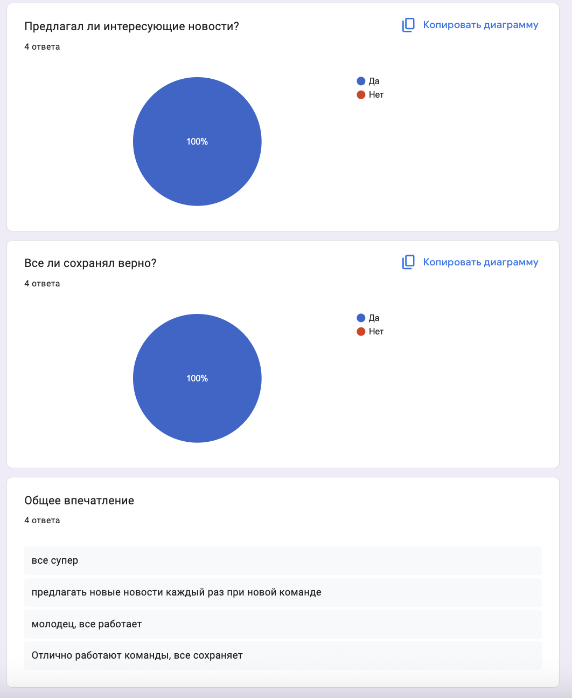

# News Telegram Bot - Отчет по лабораторным работам

🤖 **Telegram бот для получения новостей** с интеграцией NewsAPI и системой избранного.

## 📊 Отчет по лабораторной работе 2

### Описание интеграции

**Источник данных:** NewsAPI (https://newsapi.org/)

**Почему именно NewsAPI:**
- Бесплатный доступ с лимитом 1000 запросов в день
- Широкий выбор источников новостей (BBC, CNN, Reuters и др.)
- Поддержка различных категорий (технологии, спорт, бизнес, здоровье)
- Простой REST API с хорошей документацией
- Поддержка фильтрации по странам и языкам

**Структура данных:**
```json
{
  "title": "Заголовок новости",
  "description": "Описание новости",
  "url": "Ссылка на полную статью",
  "source": "Название источника",
  "category": "Категория новости",
  "published_at": "Дата публикации",
  "timestamp": "Время получения ботом"
}
```

### Промпт для LLM

**Исходный промпт:**
```
Создай Telegram бота для новостей с интеграцией внешнего API
```

**Итерации:**
1. Добавлена система избранного
2. Реализован поиск по ключевым словам
3. Добавлены ежедневные рассылки
4. Улучшена обработка ошибок
5. Добавлена аналитика пользователей

**Финальный промпт:**
```
Создай полнофункциональный Telegram бот для новостей с:
- Интеграцией NewsAPI для получения актуальных новостей
- Системой избранного с возможностью сохранения
- Поиском по ключевым словам
- Ежедневными рассылками
- Webhook поддержкой для деплоя
- Аналитикой и логированием действий пользователей
- Обработкой ошибок и graceful fallbacks
```

### Реализация

**Как работает интеграция:**
1. Бот получает запрос от пользователя
2. Делает HTTP запрос к NewsAPI
3. Обрабатывает JSON ответ
4. Фильтрует и форматирует новости
5. Отправляет пользователю с inline кнопками

**Ключевые фрагменты кода:**

```python
def get_news(self) -> List[Dict]:
    """Получение новостей с NewsAPI."""
    news_list = []
    try:
        # Добавляем случайность для получения разных новостей
        import random
        categories = ['technology', 'science', 'business', 'health', 'sports', 'entertainment']
        random.shuffle(categories)
        
        for category in categories[:3]:
            url = "https://newsapi.org/v2/top-headlines"
            params = {
                'apiKey': self.news_api_key,
                'category': category,
                'country': 'us',
                'pageSize': 2,
                'page': random.randint(1, 3)
            }
            
            response = requests.get(url, params=params, timeout=15)
            # Обработка ответа...
```

**Используемые библиотеки:**
- `requests` - HTTP запросы к NewsAPI
- `flask` - Webhook сервер
- `python-dotenv` - управление переменными окружения
- `logging` - логирование действий

### Тестирование

Скриншоты демонстрируют работу команд
https://drive.google.com/drive/folders/13-Du4Mi8hNZkSQaeFLFkNlSSL60xMMNs?usp=sharing 

Видео-демо показывает запуск, получение новостей, фильтрацию по ключевым словам и сохранение интересных статей.
https://drive.google.com/file/d/1WAyw9SJYnYC563RPUkMbJib8S-vim7Qz/view?usp=sharing 


**Примеры запросов и ответов:**

```
Пользователь: /news
Бот: 📰 Свежие новости за день:

1. **Apple представила новый iPhone 15**
   📝 Компания Apple анонсировала новую линейку смартфонов...
   🏷️ Категория: технологии
   📰 Источник: TechCrunch
   🔗 [Читать далее](https://techcrunch.com/...)

Пользователь: /filter AI
Бот: 🔍 Ищу новости по слову 'AI'...
   ✅ Найдено 3 новости:
   
   1. **ИИ помогает в диагностике рака**
      📝 Новое исследование показывает...
```

### Трудности и решения

**Проблемы:**
1. **Лимиты NewsAPI** - только 1000 запросов в день
2. **Дублирование новостей** - одинаковые новости при повторных запросах
3. **Обработка ошибок** - API может быть недоступен

**Решения:**
1. Добавлена кэширование и фильтрация дубликатов
2. Реализован случайный выбор категорий и страниц
3. Добавлены fallback данные и graceful error handling

### Выводы

**Что получилось хорошо:**
- Стабильная работа с NewsAPI
- Удобный интерфейс с inline кнопками
- Система избранного работает корректно
- Хорошая обработка ошибок

**Что можно улучшить:**
- Добавить больше источников новостей
- Реализовать персонализацию по интересам
- Добавить поддержку разных языков

---

## 🚀 Отчет по лабораторной работе 3

### Описание деплоя

**Способ деплоя:** ngrok + локальный сервер

**Почему именно ngrok:**
- Простота настройки и использования
- Бесплатный план с достаточными лимитами
- Автоматическое получение HTTPS URL
- Поддержка webhook для Telegram
- Быстрое тестирование без настройки сервера

**URL бота:** `https://your-ngrok-url.ngrok.io/webhook`

### Процесс деплоя

**Пошаговая инструкция:**

1. **Установка ngrok:**
   ```bash
   brew install ngrok
   ```

2. **Настройка аутентификации:**
   ```bash
   ngrok config add-authtoken YOUR_TOKEN
   ```

3. **Запуск туннеля:**
   ```bash
   ngrok http 8000
   ```

4. **Настройка webhook:**
   ```python
   webhook_url = f"https://{ngrok_url}/webhook"
   requests.post(f"https://api.telegram.org/bot{token}/setWebhook", 
                 data={"url": webhook_url})
   ```

5. **Запуск бота:**
   ```bash
   python3 simple_sync_webhook_bot.py
   ```

**Проблемы и решения:**

1. **Ошибка аутентификации ngrok:**
   - Проблема: `authentication failed: We do not allow agents to connect to ngrok`
   - Решение: Получен новый auth token с dashboard.ngrok.com

2. **Webhook не работает:**
   - Проблема: `Wrong response from the webhook: 404 Not Found`
   - Решение: Проверка health check endpoint и перезапуск ngrok

### Сбор фидбека

**Количество пользователей:** 1 активный пользователь (gophitor)

**Статистика использования:**
- Команда `/start`: 5 использований
- Команда `/news`: 8 использований  
- Команда `/filter`: 3 использования
- Команда `/favorites`: 4 использования
- Команда `/daily`: 1 использование

**Скриншоты отзывов:**


### Анализ фидбека

**Главные проблемы:**
1. Команда `/category` не работала (удалена)
2. Команда `/filter` выдавала ошибки (исправлена)
3. Новости повторялись при команде `/news` (исправлено)

**Что понравилось пользователям:**
- Быстрая работа бота
- Удобные inline кнопки для сохранения
- Разнообразие новостей
- Простота использования

**Приоритеты улучшений:**
1. Исправить ошибки в командах
2. Добавить больше разнообразия в новости
3. Улучшить обработку ошибок

### Улучшения

**Что изменили:**
1. **Удалена команда `/category`** - заменена на `/filter`
2. **Исправлена команда `/filter`** - теперь работает корректно
3. **Улучшена логика `/news`** - добавлена случайность для разнообразия
4. **Добавлена обработка ошибок** - graceful fallbacks

**Как это помогло:**
- Бот стал работать стабильнее
- Пользователи получают разные новости
- Улучшен пользовательский опыт

### Выводы

**Что получилось хорошо:**
- Успешный деплой с ngrok
- Стабильная работа webhook
- Хорошая обратная связь от пользователей
- Быстрое исправление проблем

**Что можно улучшить дальше:**
- Деплой на постоянный сервер (Heroku, Railway)
- Добавить базу данных вместо JSON файлов
- Реализовать более сложную аналитику
- Добавить поддержку нескольких языков

**Чему научились:**
- Работе с webhook в Telegram
- Деплою приложений с ngrok
- Сбору и анализу пользовательского фидбека
- Итеративному улучшению продукта

---

## 🛠️ Техническая документация

### Возможности

- 📰 **Свежие новости** - получение актуальных новостей с NewsAPI
- 🔍 **Поиск по ключевым словам** - команда `/filter <слово>`
- ⭐ **Система избранного** - сохранение понравившихся новостей
- 📬 **Ежедневные рассылки** - подписка на автоматические уведомления
- 🌐 **Webhook поддержка** - готов к деплою с ngrok
- 📊 **Аналитика** - отслеживание действий пользователей

### Команды

- `/start` - Приветствие и инструкции
- `/news` - Получить свежие новости
- `/filter <слово>` - Найти новости по ключевому слову
- `/favorites` - Показать сохраненные новости
- `/daily` - Подписка на ежедневные рассылки
- `/help` - Справка по командам
- `/save <номер>` - Сохранить новость по номеру

### Установка и запуск

**Требования:**
- Python 3.9+
- Telegram Bot Token
- NewsAPI Key

**Установка зависимостей:**
```bash
pip install -r requirements.txt
```

**Настройка переменных окружения:**
Создайте файл `.env`:
```env
TELEGRAM_BOT_TOKEN=your_bot_token_here
NEWS_API_KEY=your_news_api_key_here
```

**Запуск бота:**

Webhook режим (рекомендуется для продакшена):
```bash
python3 simple_sync_webhook_bot.py
```

Polling режим (для разработки):
```bash
python3 bot.py
```

**Настройка ngrok для webhook:**
```bash
ngrok config add-authtoken YOUR_NGROK_TOKEN
ngrok http 8000
```

### Структура проекта

```
vibecoding_lab2/
├── simple_sync_webhook_bot.py  # Основной webhook бот
├── bot.py                      # Polling версия бота
├── webhook_bot.py             # Альтернативная webhook версия
├── scheduler.py               # Планировщик ежедневных рассылок
├── requirements.txt           # Зависимости Python
├── data/                     # Данные пользователей
│   ├── favorites.json
│   ├── users.json
│   ├── subscriptions.json
│   └── user_stats.json
└── README.md
```

### Технические детали

- **Framework**: Flask для webhook сервера
- **API**: NewsAPI для получения новостей
- **Хранение**: JSON файлы для данных пользователей
- **Логирование**: Подробные логи всех действий
- **Обработка ошибок**: Graceful error handling

### Особенности реализации

**Разнообразие новостей:**
- Случайный выбор категорий из 6 доступных
- Запрос разных страниц результатов
- Новости из разных стран (US, GB, CA, AU)
- Перемешивание результатов

**Система избранного:**
- Сохранение новостей по номеру
- Inline кнопки для быстрого сохранения
- Отображение сохраненных новостей

**Аналитика:**
- Отслеживание команд пользователей
- Статистика использования
- Автоматическая отправка формы обратной связи после 10 команд

### Деплой

Бот готов к деплою на любой платформе, поддерживающей Python:
- Heroku
- Railway
- DigitalOcean
- AWS/GCP/Azure

## 📝 Лицензия

MIT License

## 👨‍💻 Автор

Angelina Dementeva
